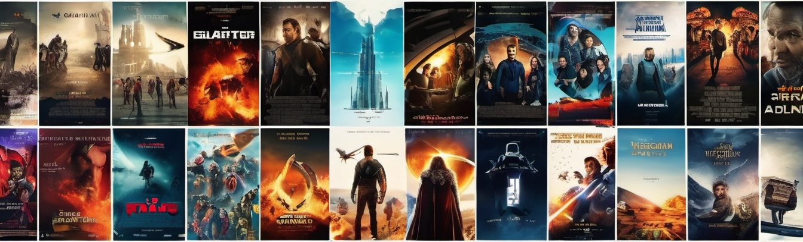
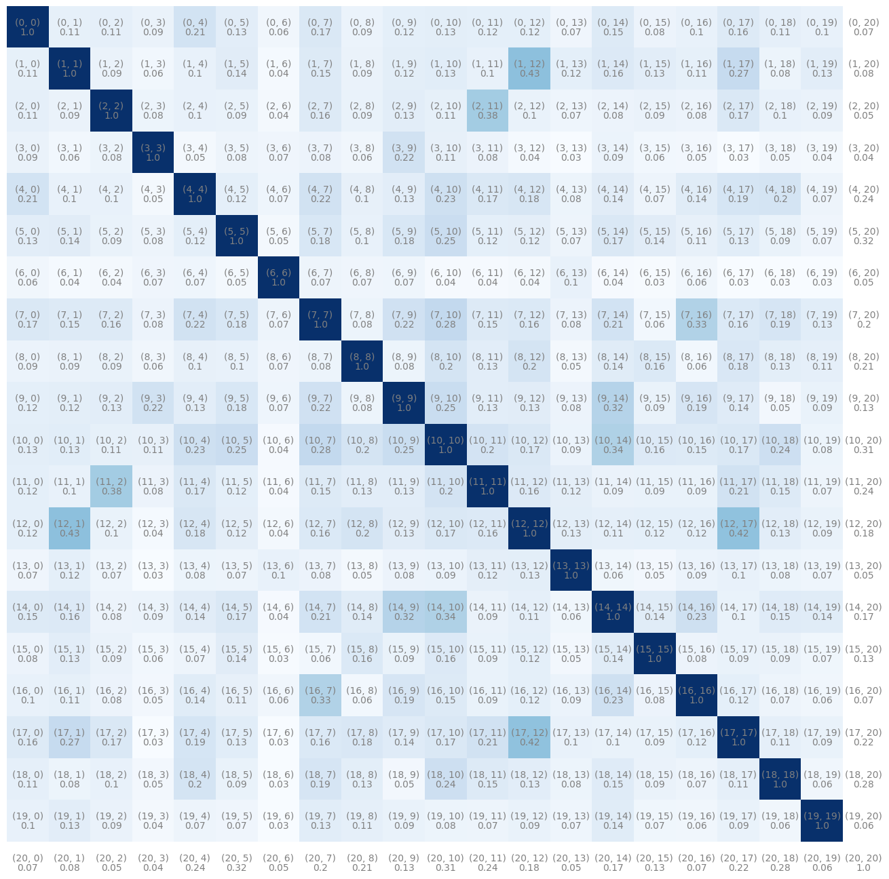

<h1 align="center">Recommendation System Using Vectorization and Cosine Similarity</h1>

## 🚀 About Recommendation Systems:

Many applications like to provide a set of recommendations to users based on their previous tastes. For example, Netflix provides movie recommendations because you watched this and movies similar to previously watched movies. These algorithms analyze users's past behavior and preferences to suggest things they might like, from movies and music to new books and clothes. They're everywhere these days, personalizing users's online experiences and making it easier to discover things they enjoy. In the project a simple version of the same is used vectorizing each movie and then finding the similarity between each movies using cosine similarity metric.

## 🛠️Steps:
- Get the data that has movie names and description of each movie.
- Choose the relevant data that are useful to find the similarity between movies.
- Remove the filler words and perform stemming to handle similar words (like work, working, worked etc).
- Find the number of most frequent words and choose a appropriate dimension to convert each movie to a vector. Vector dimension chosen here is 5000.
- Find the similarity of each movie with others and return most similar movies.

## 📊Results:
The result is we get a matrix of (n x n) which has the similarity of each movies with the other. To find the movies to recommend traverse to the row of the movie find the vector which has similarity and sort it. Return the most similar movies based on similarity.

The (n x n) can be exported using pickle and used to give the result.

#### The similarity matrix is shown below:

    

## ⚡Technologies and Concepts Used:
- `Python`
- `Stemmer`
- `Count Vectorizer`
- `Bag of Words Technique`
- `Cosine Similarity - As the dimension of vector is more.`
- `StreamLit - To build interactive web application.`

## 📈Improvements:
- The vector size can be increased to have more accurate results.
- The formation of vectors can be improved to include certain information of the movies.
- This is static, which can be made to dynamic.
- User data can also be integrated and connected to have other kinds of recommendations.
- A graph based recommendation system can be built.